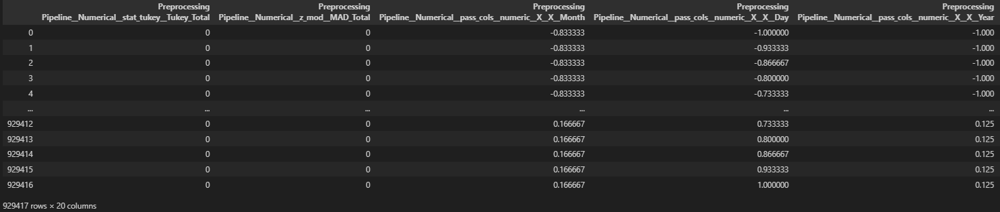
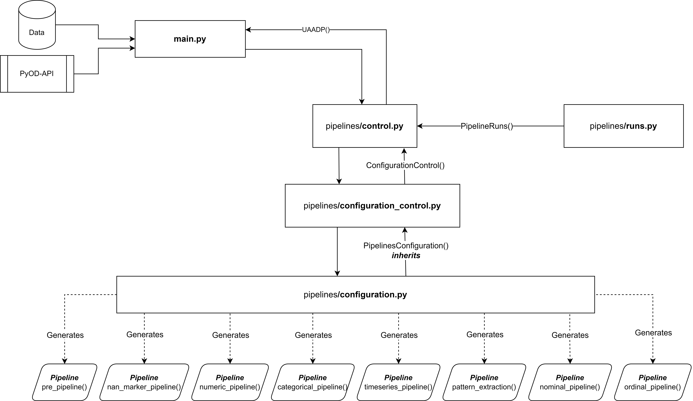

# AutoPrep -  Automated Preprocessing Pipeline with Univariate Anomaly Marking

This pipeline focuses on data preprocessing, standardization, and cleaning, with additional features to identify univariate anomalies.
<!-- <a href="https://html-preview.github.io/?url=https://github.com/JAdelhelm/Automated-Anomaly-Detection-Preprocessing-Pipeline/blob/main/visualization/Pipeline.html" target="_blank">Structure of Preprocessing Pipeline</a> -->

## Description
The Automated Preprocessing Pipeline with Univariate Anomaly Marking saves time by providing robust preprocessing, standardization, and anomaly detection, ensuring high data quality and integrity for analysis and machine learning applications ✅.

## Basic Usage
To utilize this pipeline, you need to import the necessary libraries and initialize the AutoPrep pipeline. Here is a basic example:

````python
import numpy as np
import pandas as pd
from sklearn import set_config
set_config(transform_output="pandas")
from pipelines.control import AutoPrep

df_data = pd.read_csv("./temperature_USA.csv")


pipeline = AutoPrep()    
X_output = pipeline.preprocess(df=df_data)
````

The resulting output dataframe can be accessed by using:

````python
X_output

> Output:
    col_1  col_2  ...   col_n
1   data   ...    ...   data   
2   data   ...    ...   data  
... ...    ...    ...   ...   
````

## Example



## Highlights ⭐


### 📌 Implementation of univariate methods / *Detection of univariate anomalies*
   Both methods (MOD Z-Value and Tukey Method) are resilient against outliers, ensuring that the position measurement will not be biased. They also support multivariate anomaly detection algorithms in identifying univariate anomalies.
   * MAD_Total
   * Tukey_Total

### 📌 BinaryEncoder instead of OneHotEncoder for nominal columns / *Big Data and Performance*
   Newest research shows similar results for encoding nominal columns with significantly fewer dimensions.
   - (John T. Hancock and Taghi M. Khoshgoftaar. "Survey on categorical data for neural networks." In: Journal of Big Data 7.1 (2020), pp. 1–41.)
       - Tables 2, 4
   - (Diogo Seca and João Mendes-Moreira. "Benchmark of Encoders of Nominal Features for Regression." In: World Conference on Information Systems and Technologies. 2021, pp. 146–155.)
       - P. 151

### 📌 Transformation of time series data and standardization of data with RobustScaler / *Normalization for better prediction results*

### 📌 Labeling of NaN values in an extra column instead of removing them / *No loss of information*

---
---
## Pipeline - Built-in Logic


## Abstract View (Code Structure)



---

---

## Feel free to contribute 🙂

### Reference
- https://www.researchgate.net/publication/379640146_Detektion_von_Anomalien_in_der_Datenqualitatskontrolle_mittels_unuberwachter_Ansatze (German Thesis)

### Further Information

- I used sklearn's Pipeline and Transformer concept to create this preprocessing pipeline
    - Pipeline: https://scikit-learn.org/stable/modules/generated/sklearn.pipeline.Pipeline.html
    - Transformer: https://scikit-learn.org/stable/modules/generated/sklearn.base.TransformerMixin.html


